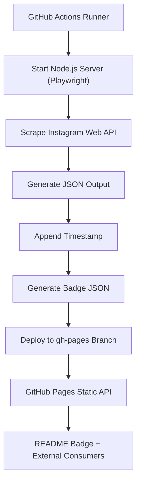

# Instagram Followers Scraper  

Sebuah otomatisasi untuk mengambil data profil Instagram (followers, following, posts, kategori, dan metadata lainnya) dengan Playwright, lalu menerbitkannya sebagai JSON melalui GitHub Pages.  
Repositori ini menggunakan pipeline DevSecOps modern dengan validasi, scanning, dan workflow yang dapat diperluas.

---

## Status Data
<a href="https://instagram.com/ziconkn_">
  
</a>

Sumber data utama:
```

[https://kimookoii.github.io/ig-followers-scraper/ziconkn_.json](https://kimookoii.github.io/ig-followers-scraper/ziconkn_.json)

````

---

## 1. Gambaran Umum
Proyek ini melakukan scraping data Instagram tanpa login menggunakan Playwright Chromium.  
Hasil scrape kemudian:

1. Dibuatkan file JSON terstruktur  
2. Disimpan ke folder `out/`  
3. Ditambahkan timestamp otomatis  
4. Diterbitkan otomatis ke branch `gh-pages`  
5. Dapat diakses publik sebagai API statis

Pipeline berjalan setiap 30 menit menggunakan GitHub Actions.

---

## 2. Arsitektur Sistem
Diagram berikut menjelaskan alur end-to-end:



---

## 3. Fitur Utama

* Scraping menggunakan Playwright Chromium headless
* User-Agent custom untuk meminimalkan blok otomatis
* JSON API publik melalui GitHub Pages
* Badges dinamis menggunakan Shields.io endpoint
* Workflow otomatis setiap 30 menit
* Mendukung fallback deploy menggunakan PAT bila GITHUB_TOKEN dibatasi
* Logging lengkap melalui `logs/server.log`
* Struktur DevSecOps-friendly

---

## 4. Struktur Output JSON

Contoh:

```json
{
  "username": "ziconkn_",
  "followers": 5927,
  "following": 2342,
  "posts": 3,
  "profilePic": "https://...",
  "private": false,
  "verified": false,
  "category": "Cemetery",
  "lastUpdate": "2025-12-02T13:00:17Z"
}
```

File tersedia di:

```
/ziconkn_.json
```

Tautan langsung:

```
https://kimookoii.github.io/ig-followers-scraper/ziconkn_.json
```

---

## 5. Penjelasan DevSecOps & Mitigasi Keamanan

### 5.1 Risiko Scraping

Scraping Instagram dapat berpotensi menghadirkan risiko:

* Pemblokiran IP (rate limit)
* Deteksi bot melalui heuristik browser
* Perubahan struktur HTML/endpoint API
* Ketergantungan terhadap CDN eksternal

### 5.2 Integritas Pipeline

Mitigasi keamanan yang digunakan:

#### a. GitHub Actions Hardening

* Penggunaan `permissions: contents: write` minimal
* PAT fallback hanya jika disediakan
* Cleanup server otomatis
* Log hanya berisi output server, tidak menyimpan kredensial

#### b. Dependencies Security

* Playwright di-instalkan melalui `npx playwright install --with-deps`
* Workflow siap diperluas dengan scanning tools seperti:

  * Trivy
  * npm audit
  * CodeQL

#### c. CVE Awareness

Beberapa potensi CVE yang perlu diperhatikan:

* Chromium vulnerabilities (Playwright otomatis mengupdate engine ke versi terbaru)
* Node.js vulnerabilities
* Dependency vulnerabilities via npm

Rekomendasi mitigasi:

* Gunakan `npm audit` di CI
* Perbarui Playwright secara berkala
* Tambahkan CodeQL scanning pada repo

---

## 6. Cara Menjalankan Secara Lokal

### Prasyarat

* Node.js 18+
* npm
* Playwright

### Install dependency

```
npm install
npx playwright install
```

### Jalankan server lokal

```
node index.js
```

Endpoint tersedia di:

```
http://localhost:3000/api/followers?username=ziconkn_
```

---

## 7. Workflow GitHub Actions

File workflow berada di:

```
.github/workflows/scrape.yml
```

Pipeline melakukan:

1. Setup Node.js
2. Install dependency
3. Install Playwright browsers
4. Start server di background
5. Scraping IG → JSON
6. Generate badge JSON
7. Deploy ke gh-pages

---

## 8. Deployment GitHub Pages

Halaman statis otomatis tersedia di:

```
https://kimookoii.github.io/ig-followers-scraper/
```

File-file JSON otomatis tersaji sebagai API publik.

---

## 9. Troubleshooting

### Tidak bisa deploy (403)

* Pastikan `permissions: contents: write` ada pada workflow
* Pastikan repository bukan fork
* Jika branch `gh-pages` dilindungi, gunakan PAT

### Server gagal start

Cek log:

```
logs/server.log
```

### JSON tidak update

Periksa log workflow GitHub Actions → step "Fetch Instagram data".

---

## 10. Kontribusi

Pull request dipersilakan.
Sebelum melakukan PR, jalankan lint & test lokal.

---

## 11. Lisensi

Proyek ini berada di bawah lisensi MIT.
Silakan digunakan untuk riset, belajar, maupun automasi pribadi.
